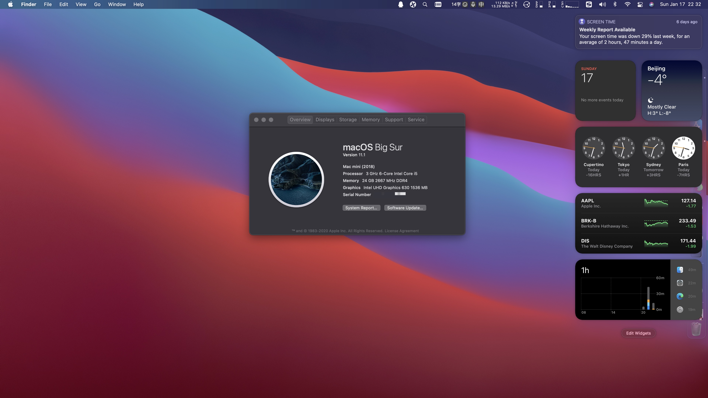
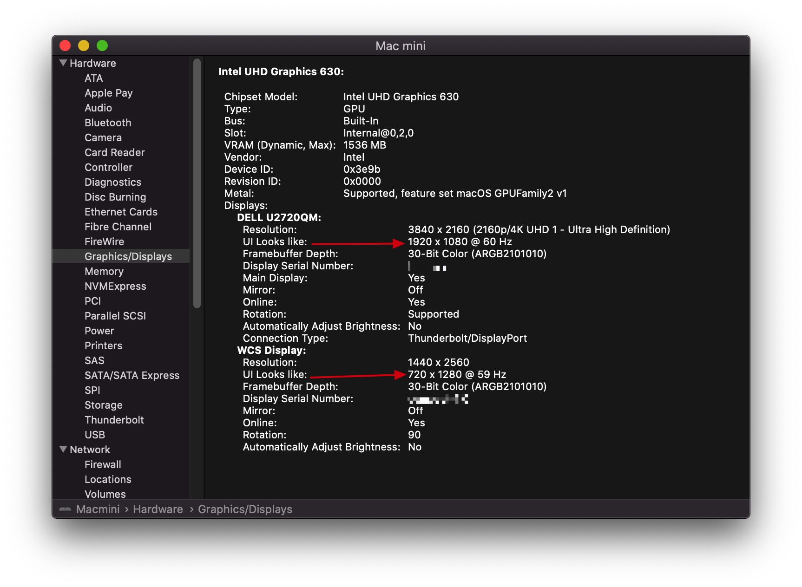
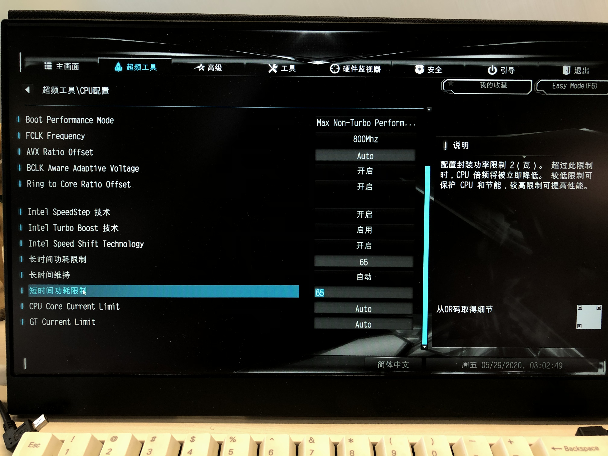
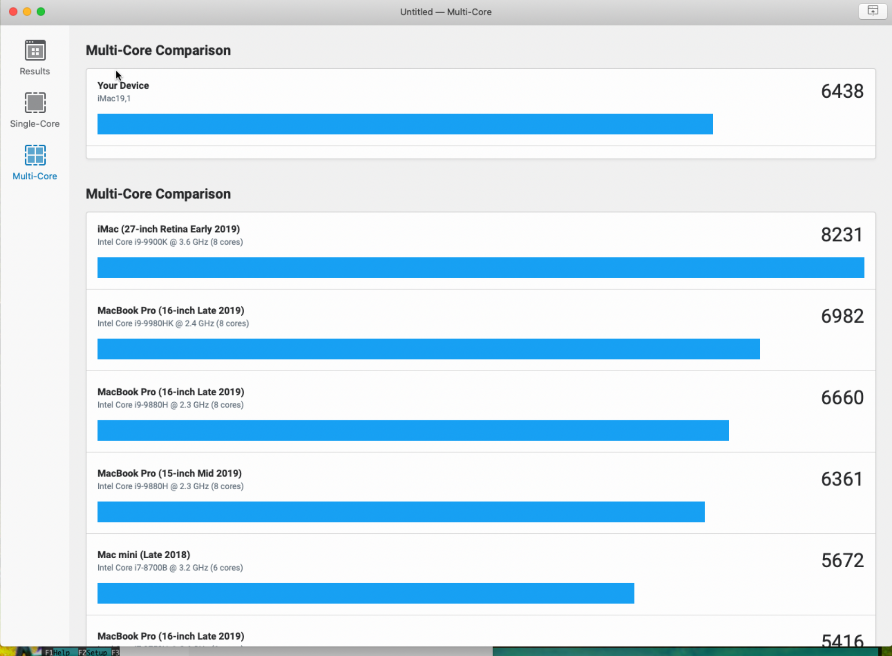

## 前言

我是**第一次**装机且**第一次**装黑果，在大佬的帮助下已经近乎完美黑果，目前已经使用7个多月，并无问题，**我只对我自己试验过的的机型，硬件，系统镜像以及使用的efi和装机工具有发言权**。对于教程和资源下文都可以获取。鼓励大家有能力要支持正版软件，一方面，任何成果都是工程师辛苦付出的结果；再者，请大家遵守相关法律法规，**本人玩这个黑果，只是出于个人娱乐目的，如有侵犯别人知识版权和商业利益，请告知本人删除相关侵权的资源**！！！

### 版本迭代

本人的 **Clover EFI**  : 适配以下系统版本（**直接升级**：15.4->15.5->15.6->15.7），备注：Clover EFI的15.6及以后的版本，已经不再维护 2020.10.27记。

本人的 **OC EFI** ：适配 10.15.x Catalina 以及 11.1 Big Sur

1. 双屏输出时，15.5及以后版本系统的HDMI口解决方案如下
   
    - **验证可行方案1**：[祖传土方根治10.15.5正式版UHD630黑屏问题](http://bbs.pcbeta.com/viewthread-1859830-1-1.html)，感谢群友 @https://github.com/twotreeszf 的验证 备注：2020.06记
    - **验证可行方案2**: [Whatevergreen.kext](https://github.com/acidanthera/WhateverGreen/releases/) （更新到1.4.1以后） ，感谢群友 @https://github.com/xiangsanliu 验证此方案的可行性！—— 备注：2020.10.27记
    
2. deskmini爱好者群：

    

在原来硬盘上分区出来或者在另外一个硬盘上面可以随便升级和试验操作而且不会影响你当前正在使用的稳定MacOS版本，这样稳定和可玩性都具备（有时间折腾的朋友必备）：

1. [苹果官网：在单独的 APFS 宗卷上安装 macOS](https://support.apple.com/zh-cn/HT208891) 官网第一句话：通过 APFS，您可以更轻松地在不同版本的 macOS 之间切换，包括 Beta 版（预发布版）macOS。
2. [苹果官网：在 Mac 上的“磁盘工具”中将物理磁盘分区](https://support.apple.com/zh-cn/guide/disk-utility/dskutl14027/mac) 

## 装机结果

### Bios版本 

目前我使用主板版本号是P4.2， 主板上有贴纸可以查看或者直接问你购买的店家的客服，也可以到官网下载新版本。我买回来以后，一直没动它。

### 完成的功能

- Ethernet/WIFI/Bluetooth/Audio/USB&EX-USB/Sensors

- DP(4K 60Hz), HDMI(4k 30Hz) dual monitor output 

- Shutdown/Sleep

  两口开机睡眠均能唤醒不黑屏

- IMessage/FaceTime/AppStore/iCloud/AirDrop/Handoff/SideCar 

- VideoProc(仅供参考): H264/HEVC(即H265)/Hardware Decoder 

  核显硬解已经测试通过：在视频转码时，通过Intel Power Gadget查看GPU频率，也可以使用Final Cut Pro X来验证。

- HWP：Intel 的 **H**ARD**W**ARE-CONTROLLED **P**ERFORMANCE STATES (HWP)，启用HWP即可按照自己的意愿设置CPU的最低、日常想要的频率、最高频率，开启性能模式以后，我的i5 8500 CPU一直维持在4GHz上下。注意：我上传的EFI没有开启这个功能，原因是：不是通用需求，如有需要按照下列教程自行更改：

  - [一条命令教你如何确认自己的机型及如何开启HWP](https://blog.daliansky.net/A-command-to-teach-you-how-to-confirm-their-own-models-and-how-to-open-the-HWP.html)
  - [启用HWP 锁定CPU最高频率 让CPU展示其真正实力吧!~](http://bbs.pcbeta.com/viewthread-1798057-1-1.html)
  
- HiDPI——优化各个分辨率下的显示器显示效果，[HiDPI是什么？以及黑果如何开启HiDPI](https://www.sqlsec.com/2018/09/hidpi.html)

  

### 未完成的功能

1. VGA 口（最高只支持1080p，苹果系统用1080p太为难了）。有人在7代U上成功了：[VGA+HD630在10.15.4上成功驱动显卡](https://www.bilibili.com/video/BV12k4y1R7Ko)，也可以使自己使用Hackintool定制？可是原生机型并没有VGA口。
2. SD卡待测，没有SD卡，暂不需要，需要的请注意。

## 硬件配置

| 项目类型  | 具体型号                                                     | 价钱（RMB）（2020.3月份中旬购买自从疫情，全部涨价） | 购买渠道                                                     |
| --------- | ------------------------------------------------------------ | --------------------------------------------------- | ------------------------------------------------------------ |
| 固态      | 海康威视 c2000 pro 1TB （没有一赔三，有的话麻烦请告知渠道，赔偿分你一些，嘻嘻） 1. 写入2.7G/s 读取3.1g/s——测速工具Mac版本的DiskSpeedTest，没有持续压力测试（软件自带压力测试最多是5G）  2. 实测体验：3.0 U盘（读取速度100MB/s）拷贝28G多到这块盘，不到3分钟。 3. 占满200多G以后，日常使用中，随机测速：写入2.55 -> 2.78G/s 读取2.75 -> 3.1G/s——测速工具Mac版本DiskSpeedTest，没有持续压力测试（软件自带压力测试最多是5G） | 939                                                 | 狗东                                                         |
| 风扇      | 猫头鹰静音风扇NH-L9i（淘宝有卖家专门给风扇喷涂石墨烯，导热效果更好，本人没有试验过） | 300                                                 | 狗东                                                         |
| 无线网卡  | M2接口转接卡+苹果原装拆机卡BCM94360CS2 （免驱动） + 双天线 5月底更新：**[IntelWIFI 网卡也能用啦](http://bbs.pcbeta.com/viewthread-1856465-1-1.html)** | 182                                                 | 猫厂                                                         |
| CPU       | 8500 散片，拿到手开机电压 0.98v 并且正常使用中               | 1356                                                | 狗东第三方卖家（略贵一点点）                                 |
| 内存      | 威刚8g 2666Hz * 2                                            | 544                                                 | 狗东（最贵的时候买入，肠子都悔青了，建议大家使用比价软件查看历史价格） |
| 机箱+主板 | deskmini 310                                                 | 979                                                 | 狗东                                                         |

**注意**：Deskmini-h310 主板功耗选项 Auto（主板有功耗锁）

据 @https://github.com/twotreeszf （配置：9900t ES 1.7Ghz基频版本，TDP：35W）反馈，所有测试截图均在下面。知乎上其他网友也是这样的设置，才发挥出了相同的效果。**从得到有限样本总结来说，intel 9900t低压CPU的Auto策略偏保守，还要注意主板本身对CPU功耗而不是TDP的限制，非低功耗版本的i7 i9 CPU由于这个限制，不能完全发挥**。大家根据自身CPU设置合适值来物尽其用！

|  |  |
| ------------------------------------------------------------ | ------------------------------------------------------------ |
| 在主板bios设置里，“长时间功耗限制”，“短时间功耗设置”都改为65w(主板原先的默认值为：Auto) | 多核GeekBench跑分性能提升近1000分，多核跑分超过2019 15寸 Macbook Pro顶配版跑分（Macbook CPU 15寸顶配是 i9-9880h） |

## 装机过程

[Deskmini-h310 小白硬件组装视频教程](https://www.bilibili.com/video/BV1bt411m77L/?spm_id_from=333.788.videocard.0)，镜像使用的是：黑果小兵网站下载镜像以后，注意校验下载的镜像有木有损坏，**必须校验**，不能跳过！

### Bios设置

我的bios版本是P4.2，插入U盘开始装MacOS开始前设置

- Load UEFI Defaults(F9)

- Advanced

  - CPU Chip Set
    - Vt-d:  Disabled,
    - Onboard HD Audio: Enabled
  - CPU Configuration

    - CPU C STATE SUPPORT: Enabled
  - CFG Lock: Disabled (**注意**：这个设置才能原生电源管理)
  - USB Configuration

    - XHCI Hand-off：Enabled
  - Super IO Configuration

    - Serial Port: Disabled（必须）
  - Security
  - Secure Boot: Disabled(by default)
  - Boot
  - CSM enable: only UEFI

**注意**：装机和黑果有风险，注意重要的数据提前备份。

[孰优孰劣？OC引导与clover引导对比，现在有必要强行更换OC引导吗](https://www.bilibili.com/video/BV1zE411T7RB)

1. **Clover引导**
- 小白根据这个 [视频教程](https://www.bilibili.com/video/BV1da4y147my) ：按照视频教程操作到 13:11，因为m2型号的固态硬盘上只安装MacOS，所以只进行到 13:11，**然后不要拔掉U盘**，使用Clover Configurator工具将U盘里面的efi（注意不是winpe目录下的efi，而是跟winpe同一级目录的efi文件夹）替换掉装完机的MacOS系统上的EFI。下一步就是（这一步作用——防止跟别人一样进而影响到你的苹果账号的使用，严重的话会被苹果封号）：[更改三码](https://blog.csdn.net/weixin_43912833/article/details/102408559) 。
   - [【知其然01】黑果CLOVER引导的目录构成及详解](https://www.bilibili.com/video/BV1BE411j7GE) 
   - [【知其然02】黑果clover引导，如何配置属于自己的EFI？](https://www.bilibili.com/video/BV17E411p7hh/)
   - [从零玩转黑白苹果——**Clover引导升级**](https://www.bilibili.com/video/BV14K4y1r7TQ?from=search&seid=9191168693124119756)

2. **OpenCore引导**

   - 跟Clover引导的安装过程一样，只不过替换U盘中的系统EFI的时候，采用xjn大佬博客分享的EFI，然后进行了细微调整。
   - 视频
     - [Intel Coffee Lake平台完美黑果系统安装教程（Opencore+Catalina15.4）](https://www.bilibili.com/video/BV1hA411t7dr/)，up主带你亲自阅读官方教程，一步步配置参数和驱动讲解，讲解参数含义与作用。[【司波图】10代最强带核显黑苹果装机实战及性能演示，附安装所需的注意事项](https://www.bilibili.com/video/BV17t4y1y7uu)
     - 油管从零开始的教程：[To create a vanilla hackintosh from scratch, you can follow this guide](https://www.youtube.com/watch?v=6KGuINOyHh0)
     - [黑果OpenCore引导配置教程01：EFI文件夹的整理](https://www.bilibili.com/video/BV1gE411L7Sw)
     - [黑果OpenCore引导配置教程02：config的详细设置](https://www.bilibili.com/video/BV1nE411j7Wm/?spm_id_from=333.788.videocard.0)
     - [【知其然03】那些黑果安装使用中常见的名词](https://www.bilibili.com/video/BV1Z7411n7fJ/?spm_id_from=333.788.videocard.1)
   - [**升级OC引导**和最好用的配置工具介绍](https://www.bilibili.com/video/BV11i4y1L7Mn)

## 4K IPS显示器推荐

按🐶东性价比由低到高：

1. KOIOS、小米
2. AOC、创维、优派（ViewSonic）、飞利浦（被AOC收购）、游戏领域：微星、华硕等等
4. 明基（做工著称）、Samsung、LG、Dell（售后著称）
6. 苹果官网卖得显示器：[LG UltraFine 4K 显示屏](https://www.baidu.com/link?url=rk8XC7856Tlj_qbbRc-XDx3-MfQQYfo5Htb6TlG4_wODI7azGAt6wKdH6FLiCWgiOnt3hDu6TIiMsB_aOrdOw_&wd=&eqid=9c2af2c800024023000000055ed9102e) ，[LG UltraFine 5K 显示屏](https://www.baidu.com/link?url=t46PgIIcXszD-1LXJK4AcPl2wYsgZnpcd-7XYDoNuyDQ5abJdGxVAN1fcxCQa9oXigGS0d6OZvW4dNiV9pcIY_&wd=&eqid=9c2af2c800024023000000055ed9102e)， [Pro Display XDR](https://www.apple.com.cn/pro-display-xdr/)
5. ······更专业的显示器

**注明：** 每个牌子都有不同系列显示器，都有高中低端系列，主要关注这些参数（ 大而全的小白科普文章[显示器选购中有哪些坑？2020 有哪些显示器推荐？ - Orange的文章 - 知乎](https://zhuanlan.zhihu.com/p/111413153) ）：

- **色域、色域覆盖（不等于色域容积）、色准、色深、色温、白点**：苹果电脑都是是Display P3不是DCI-P3，[色域是什么？ 显示器屏幕色域sRGB,NTSC,Adobe RGB,P3,PAL区别对比](https://zhuanlan.zhihu.com/p/136403493)
- **PPI**（Pixels Per Inch）：[分辨率和像素是什么关系？ - 小7的背包的回答 - 知乎](https://www.zhihu.com/question/21149600/answer/724435661)
- **静态对比度（不是动态对比度）**：屏幕能显示的最亮和最暗的亮度比值，比值越大那么从最暗到最亮的渐变变化阶梯数就越多，画面层次就越丰富，表现力就更强，特别显示暗部和阴影的时候不会显示一团黑而是渐变的，即有层次。
- **面板**：[显示器TN、IPS、VA面板类型哪个好? - 林远的回答 - 知乎](https://www.zhihu.com/question/57854431/answer/868319230) 
- 出厂校色就是产品出厂之前厂家帮你校色了，然后送到经销商手上。
- 三包政策。

**注意：** 有Type C接口可以给笔记本电脑反向充电，这样连一根线到显示器，笔记本又可以充电又可以扩展屏幕。桌面干净整洁。

## 资源

#### 官方驱动下的第一手资源

无论是远景论坛还是各种黑苹果社区，很多帖子都是网友第二次加工，由于网友水平参差不齐，建议大家还是直接看各个驱动官方的文档，有时候看英文版开始慢一点但是让你少走的弯路从而节省的时间比看二次加工的信息在总时间上来说更节约。

1. **驱动bug问题追踪**：https://github.com/acidanthera/bugtracker，查看本仓库下的issues问题，可能可以找到拥有同样问题的人。
2. **WhateverGreen 驱动** github 中文介绍页：https://github.com/acidanthera/WhateverGreen/blob/master/Manual/FAQ.IntelHD.cn.md 这里大家也可以看看英文版：https://github.com/acidanthera/WhateverGreen/blob/master/Manual/FAQ.IntelHD.en.md 根据每个文档更新时间，进行有效的跟踪，及时作出调整。也有俄语版本…俄罗斯人的计算机和数学向来很强！！可以去小兵大哥博客自行获取俄语论坛资料。
3. **Lilu 驱动 github 主页**： https://github.com/acidanthera/Lilu
4. **AppleALC 音频驱动** github中文页：https://github.com/acidanthera/AppleALC/blob/master/README_CN.md [小兵哥亲受教程：使用AppleALC声卡仿冒驱动AppleHDA的正确姿势](https://blog.daliansky.net/Use-AppleALC-sound-card-to-drive-the-correct-posture-of-AppleHDA.html)。
5. **Virtual SMC 虚拟的系统控制器驱动**：https://github.com/acidanthera/VirtualSMC。
6. **Intel Onboard Ethernet LAN（local area network） 因特尔板载的以太网局域网驱动**：https://github.com/acidanthera/IntelMausi
7. **USB 口驱动**：https://github.com/RehabMan/OS-X-USB-Inject-All 英文教程：https://www.tonymacx86.com/threads/the-new-beginners-guide-to-usb-port-configuration.286553/ 中文在小兵大哥的博客上有。
8. **Intel WI-FI 网卡固件库**：https://github.com/zxystd/itlwm 有介绍可以使用的intel网卡型号，作者亲自写的使用帖子 ：http://i.pcbeta.com/space-uid-3537092.html。
9. **Intel Bluetooth 固件库**： https://github.com/zxystd/IntelBluetoothFirmware，教程如同上条。
10. **设备属性转换工具库**：https://github.com/acidanthera/gfxutil
11. **OC引导台式机官方教程**：https://dortania.github.io/OpenCore-Desktop-Guide/
12. **OC引导官方库**：https://github.com/acidanthera/OpenCorePkg
13. **Hackintool： 实现USB定制，视频输出端口匹配等功能** ：https://github.com/headkaze/Hackintool

#### 黑果小白上手学习资源

注意在驱动的作用方面Clover引导与OpenCore引导并无差别，含义可以借鉴理解。

3. [【黑果】MacOS Catalina 10.15.4 详细安装过程实录(附有工具下载链接)](https://www.bilibili.com/video/BV1da4y147my)
4. [教程：利用Hackintool打开第8代核显HDMI/DVI输出的正确姿势](https://blog.daliansky.net/Tutorial-Using-Hackintool-to-open-the-correct-pose-of-the-8th-generation-core-display-HDMI-or-DVI-output.html)
5. [黑果-HDMI输出简单教程](https://www.bilibili.com/video/BV1AT4y157oJ)，启发：机型匹配，毕竟原生的系统就是一一定制的结果。
7. [Hackintool教程——给FrameBuffer打补丁以驱动核显](https://www.bilibili.com/v/technology/wild/) 英文版： [Guide: Intel Framebuffer patching using WhateverGreen](https://www.tonymacx86.com/threads/guide-intel-framebuffer-patching-using-whatevergreen.256490/post-1856330)
8. [macOS Catalina 10.15安装中常见的问题及解决方法](https://blog.daliansky.net/Common-problems-and-solutions-in-macOS-Catalina-10.15-installation.html)
9. oc引导，傻瓜式教程，内含EFI：[华擎 DeskMini 310 黑果（hackintosh） 10.15（Catalina） OpenCore配置](https://www.bzqll.com/2020/01/329.html)
10. [【吃瓜】CPU超频？别问！问就是不会！](https://www.bilibili.com/video/BV1Ak4y1k7Wo/?spm_id_from=333.788.videocard.1)

## Mac 软件分享

1. 外接显示器亮度音量调节：https://github.com/the0neyouseek/MonitorControl
2. 分别调节每个应用程序的音量：Sound Control
3. U盘多种格式读写工具（建议格式化U盘或者硬盘为ExtFat格式，这种格式所有系统都能读写）：https://mp.weixin.qq.com/s/AOiku5o-YE_GnlyKeavjHA
4. iRightMouse 超级右键，AppStore可下载，官网也有Bug反馈，服务很好。帮助实现以下主要的功能（还有其他功能可谷歌）：
    - 剪切
    - 从终端打开目前文件（夹）路径
    - 将当前路径拷贝到系统剪切板
    - 创建新文件（支持好多格式：txt, office 全家桶，markdown , xml 等等）
    - 文件发送到常见文件夹路径
    - 给文件打上对应的应用程序的图标
5. Kexts(Kernel extensions)缓存刷新工具（升级系统必备）——Kexts Utility：http://bbs.pcbeta.com/viewthread-1802862-1-1.html
6. Kexts(Kernel extensions)驱动更新工具（升级系统必备）——Kexts Updater
7. 打补丁工具——Hackintool
8. 系统监控工具（CPU，温度，硬盘，风扇，网速，内存，GPU）——iStat Menus
9. 截图软件（可以滚动截图）——Xnip
10. 翻译软件：Copytranslator
11. 词典软件：欧路词典
12. PDF：福昕阅读器
13. Markdown编辑器：Typora或者Vim
14. 录屏软件：iShot
15. 动图软件：LICECap
16. 脑图软件：XMind
17. 网速工具：网速管家
18. MacOS跑分工具：GeekBench，CineBench R15/R20
19. 各大视频网站视频下载工具：Downie
20. 视频全能播放器：IINA
21. 快捷键提示工具：CheatSheet
22. 截图文本识别（顺带翻译）：Text Scanner
23. Office套件：WPS，Office 2019 Mac 版下载 https://blog.tlhub.cn/Office-2019-for-Mac
24. 视频剪辑软件：Final Cut Pro x
25. 下载软件 Motrix， 类似windows下的EagleGet
26. 状态指示太长栏进行折叠，Bartender
27. 系统信息管理工具：Sensei（尽管类Unix系统整这个没意义）

**MacOS软件分享网站：**

1. [https://xclient.info](https://xclient.info/)
2. AppStore
3. 每个软件官网
4. github
5. brew [cast] install
6. https://chengxuxiaohei.cn/mac-down-url.html

## MacOS使用技巧

1. [MacBook、Mac新手必备的20个小技巧，效率提升](https://www.bilibili.com/video/BV19t4y117Lr/)
2. [Mac图文操作说明指南](https://pan.baidu.com/s/1B0lYYeraRwLXLd-Qn-gRIA) 提取码：0375 来自群友 @https://github.com/twotreeszf分享

## 使用过程的问题

### 台式电脑突然断电后无法启动

1. 主板放下电。关机，插排电源也关掉。把主板BIOS电池取下。五分钟后，重新插入BIOS电池，开机，如果能开，选择Load Optimize Default 载入BIOS默认设置。
2. 电源这边，可以找其他电源替换一下，或者把自己的电源用在其他机器试一下。另外不要忽视电源线的问题。
3. 突然断电后无法启动是由于主板突然断电的自动保护所致，过段时间能够开机算是正常的。

## 致谢

1. https://github.com/appleserial/DeskMini

2. https://github.com/xjn819/Hackintosh-Deskmini310-EFI

3. https://github.com/csrutil/DeskMini

4. https://github.com/cnsilvan/deskmini310_hackintosh

5. https://github.com/zsyshuyang/Hackintosh-EFI-For-Deskmini-310-i5-9400-DW1560

6. https://github.com/liminghuang/asrock_deskmini310_hackintosh

7. https://github.com/yuqi/Deskmini-310-Hackintosh

8. https://github.com/isNextJuly/Hackintosh-EFI-for-deskmini-310-i7-8700

9. https://github.com/leogitpro/Hackintosh-DeskMini310

   

