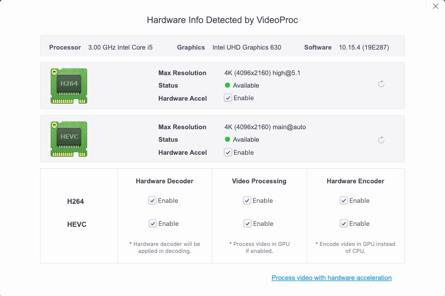
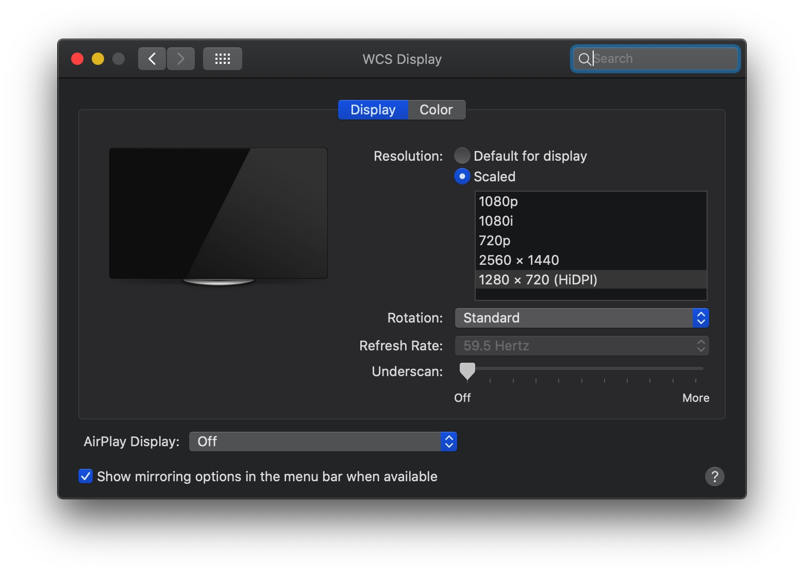
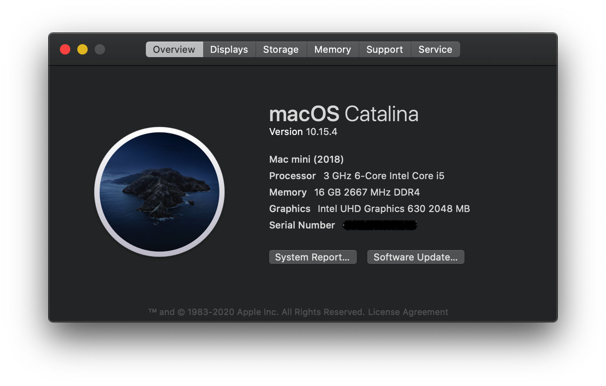
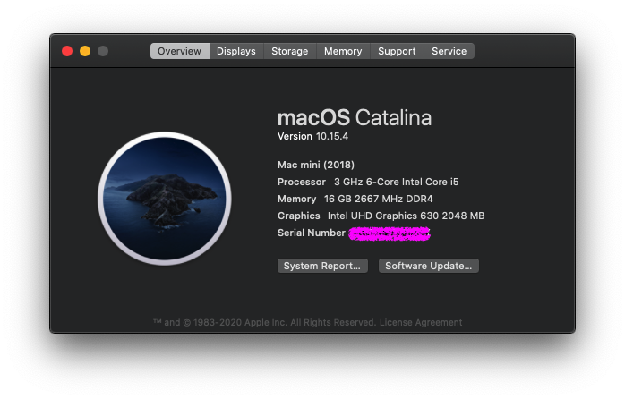
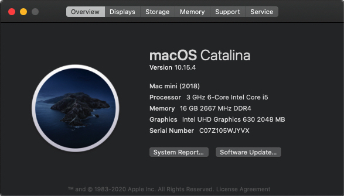
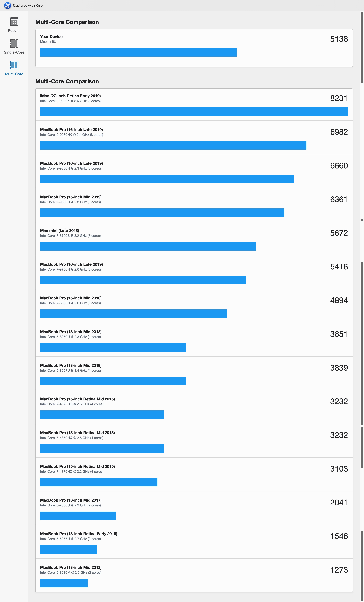

## 前言

我是**第一次**装机且**第一次**装黑果，在大佬的帮助下已经近乎完美黑果，目前已经使用一个月，并无问题，**我只对我自己试验过的的机型，硬件，系统镜像以及使用的efi和装机工具有发言权，其他我不懂，勿扰**。对于教程和资源下文都可以获取。鼓励大家有能力要支持正版软件，一方面，任何成果都是工程师辛苦付出的结果；再者，请大家遵守相关法律法规，**本人玩这个黑果，只是出于个人娱乐目的，如有侵犯别人知识版权和商业利益，请告知本人删除相关侵权的资源**！！！

### 版本迭代

本人的 EFI : 适配以下系统版本

1. Catalina 15.4 : 已经测试未发现问题
2. Catalina 15.5 : 双屏输出HDMI口待验证，其他经验证没有问题
    - [有大神能解决八代核显10.15.5hdmi黑屏问题吗？](http://bbs.pcbeta.com/viewthread-1858867-1-1.html)（仿冒成7代KABY LAKE的ID就亮屏了，具体查看链接）
    - [macos catalina 10.15.5 (19F96) hdmi external display black screen #938](https://github.com/acidanthera/bugtracker/issues/938) 

## 装机结果

### Bios版本 

目前我使用主板版本号是P4.2， 主板上有贴纸可以查看或者直接问你购买的店家的客服，也可以到官网下载更新到新版本。我买回来以后，一直没动它。

### 完成的功能

- Ethernet/WIFI/Bluetooth/Audio/USB&EX-USB/Sensors

- DP/HDMI dual monitor output **两口开机睡眠均能唤醒不黑屏**

- Shutdown/Sleep

- IMessage/FaceTime/AppStore/ICloud/AirDrop/Handoff/SideCar随航 

- HWP enable: **按照自己的意愿设置CPU的最低、日常想要的频率、最高频率**

- VideoProc(仅供参考): H264/HEVC(即H265)/Hardware Decoder (**核显硬解已经测试通过：通过视频转码查看GPU频率，也可以使用Final Cut Pro X来验证**）

    

- 系统对风扇自动调速

- CPU 睿频

- HiDPI——优化各个分辨率下的显示器显示效果

    开启HiDPI以后，在偏好设置里面选择（我是便携超薄显示器 2k 72%NTSC约等于100%SRGB）：

    

    下面第一张是开启HiDPI-720p，第二张1080p，第三张2k，对比一下观感:

    1. 开启HiDPI-720p

        

    2. 1080p
    
        
    
    3. 2k
    
        

### 未完成功能

1. VGA ：mac系统不支持vga！
2. SD卡待测，没有SD卡，暂不需要，需要的请注意。

## 本人需求

我作为小白用户只求装完机，安安静静地使用 MacOS 带来的便利性，装机越简单功能越完善越好，任何软件系统重要的是服务用户的使用，我也不会不断升级，系统稳定最重要。

## 硬件配置

| 项目类型  | 具体型号                       | 价钱（RMB）（3月份中旬购买） | 购买渠道 |
|:-------: | ------------------------------ | :---------: |--------- |
|   固态    | 海康威视 c2000 pro 1TB （没有一赔三，有的话麻烦请告知渠道，赔偿分你一些，嘻嘻） 写入2.7G/s 读取3.1g/s——测速工具Mac版本DiskSpeedTest，没有持续压力测试（软件自带压力测试最多是5G），实测体验：3.0 U盘（读取速度100MB/s）拷贝28G多到这块盘，不到3分钟。 |     939     | 狗东 |
|   风扇    | 猫头鹰静音风扇NH-L9i（淘宝有卖家专门给风扇喷涂石墨烯，导热效果更好，本人没有试验过） |     300     | 狗东 |
| 无线网卡  | M2接口转接卡+苹果原装拆机卡BCM94360CS2 （免驱动） + 双天线 |     182     | 淘宝 |
|    CPU   | 8500 散片，拿到手开机电压 0.98v 不错 |  1356   | 狗东第三方卖家（略贵一点点） |
|   内存    | 威刚8g 2666Hz * 2              |     544     | 狗东（最贵的时候买入，肠子都悔青了，建议大家使用比价软件查看历史价格） |
|  显示器   | 便携 2k 显示器                 |     658     | 淘宝 |
| 机箱+主板 | deskmini 310                   |     979     | 狗东 |

自从疫情，全部涨价，我购买日期3月中旬，年前起码便宜六七百。小白第一次装机，没有旧配件和垃圾佬的水平，咸鱼也不碰，以后捡垃圾玩玩😆，不着急的小伙伴等6.18或者疫情过去又或者Intel新一代的CPU发布，到那时候价格比较香。我的黑果跑分如下，跟其他白苹果的对比：

## 装机过程

### Bios设置（P4.2）插入U盘开始装MacOS开始前设置

- Load UEFI Defaults(F9)

- Advanced

    - Onboard HD Audio: Enabled
    - USB Configuration, XHCI Hand-off, Enabled
    - Super IO Configuration, Serial Port, Disabled（必须）

- Security

    - Secure Boot, Disabled(by default)

- Boot

    - only UEFI

- CPU Chip Set  

    - CPU C STATE SUPPORT ENABLED->CFG Lock Disabled (**注意**：解除这个锁定才能HWP)

    

我这个小白根据这个 [视频教程](https://www.bilibili.com/video/BV1da4y147my) ：我按照视频教程操作到 13:11，因为我的m2型号的固态硬盘上只安装MacOS，所以我只进行到 13:11，**然后不要拔掉U盘**，使用Clover Configurator工具将U盘里面的efi（注意不是winpe目录下的efi，而是跟winpe同一级目录的efi文件夹）替换掉装完机的MacOS系统上的EFI。下一步就是：https://blog.csdn.net/weixin_43912833/article/details/102408559 。

**注意**：装机和黑果有风险，注意重要的数据提前备份。

 ## 资源

#### 本机型相关资源

1. 目前我本人使用 **EFI** : https://github.com/zsyshuyang/Hackintosh-EFI-For-Deskmini-310-i5-9400-DW1560 大佬的分享，然后进一步修复如下功能（小白的话直接将我的EFI替换掉系统盘的EFI即可）：

    - 修复了HDMI口开机和睡醒黑屏问题（即无信号问题）
        - 在Clover Configurator中将你的config.plist的Boot中将`igfxonln = 1`添加到您的启动参数中即可。详解参考：http://bbs.pcbeta.com/viewthread-1850729-1-1.html
    - 电源选项：加载原生电源管理
        - 在Clover Configurator中将你的config.plist文件中点击ACPI，在ACPI页面右下角的`PluginType`选项勾选即可。
    - 开机跳过Clover选择系统界面，直接进入白苹果系统的的加载进度条，生活工作基本上不需要Windows，为了以防万一也已经装了Windows虚拟机。**注意**：我上传的EFI没有开启这个功能，原因是：不是通用需求，如有需要按照下列教程自行更改：
        - https://baijiahao.baidu.com/s?id=1651061346132267912&wfr=spider&for=pc
    - 开启HiDPI
        - [HiDPI是什么？以及黑果如何开启HiDPI](https://www.sqlsec.com/2018/09/hidpi.html)
    - HWP：Intel 的 HARDWARE-CONTROLLED PERFORMANCE STATES (HWP)，启用HWP即可锁住CPU最高频率，开启性能模式以后，我的i5 8500 CPU一直维持在4GHz上下。**注意**：我上传的EFI没有开启这个功能，原因是：不是通用需求，如有需要按照下列教程自行更改：
        - [一条命令教你如何确认自己的机型及如何开启HWP](https://blog.daliansky.net/A-command-to-teach-you-how-to-confirm-their-own-models-and-how-to-open-the-HWP.html)
        - [启用HWP 锁定CPU最高频率 让CPU展示其真正实力吧!~](http://bbs.pcbeta.com/viewthread-1798057-1-1.html)

    我已经将我的 **EFI** 分享到本页面了。

2. 镜像使用的是：

    -  黑果小兵分享的 [10.15.4 19E287 双EFI 分区版](https://blog.daliansky.net/macOS-Catalina-10.15.4-19E266-Release-version-with-Clover-5107-original-image-Double-EFI-Version-UEFI-and-MBR.html#more) 

    - 下载镜像以后，注意校验下载的镜像有木有损坏，**必须校验**，不能跳过！

        黑果小兵的 `macOS Catalina 10.15.4(19E287) Installer for Clover 5109 and WEPE Support UEFI and MBR.dmg` 的MD5值为 `c84ebeeb84c074729c11afca91c6f952`

#### 黑果上手学习资源

1. oc引导，傻瓜式教程，内含EFI：[华擎 DeskMini 310 黑果（hackintosh） 10.15（Catalina） OpenCore配置](https://www.bzqll.com/2020/01/329.html)
2. [【知其然01】黑果CLOVER引导的目录构成及详解](https://www.bilibili.com/video/BV1BE411j7GE)
3. [【知其然02】黑果clover引导，如何配置属于自己的EFI？](https://www.bilibili.com/video/BV17E411p7hh/)
4. [【知其然03】那些黑果安装使用中常见的名词](https://www.bilibili.com/video/BV1Z7411n7fJ/?spm_id_from=333.788.videocard.1)
5. [【黑果】MacOS Catalina 10.15.4 详细安装过程实录(附有工具下载链接)](https://www.bilibili.com/video/BV1da4y147my)
6. [HiDPI是什么？以及黑果如何开启HiDPI](https://www.sqlsec.com/2018/09/hidpi.html)
7. [教程：利用Hackintool打开第8代核显HDMI/DVI输出的正确姿势](https://blog.daliansky.net/Tutorial-Using-Hackintool-to-open-the-correct-pose-of-the-8th-generation-core-display-HDMI-or-DVI-output.html)
8. [黑果-HDMI输出简单教程](https://www.bilibili.com/video/BV1AT4y157oJ)
9. [Mojave UHD 630 on i5 8400 issues, have tried everything](https://www.tonymacx86.com/threads/mojave-uhd-630-on-i5-8400-issues-have-tried-everything.269368/page-3#post-1889723)
10. [Guide: Intel Framebuffer patching using WhateverGreen](https://www.tonymacx86.com/threads/guide-intel-framebuffer-patching-using-whatevergreen.256490/post-1856330)
11. [Hackintool教程——给FrameBuffer打补丁以驱动核显](https://www.bilibili.com/v/technology/wild/)

## Mac 软件分享

1. 外接显示器亮度音量调节：https://github.com/the0neyouseek/MonitorControl
2. 分别调节每个应用程序的音量：Sound Control
3. U盘多种格式读写工具（建议格式化U盘或者硬盘为ExtFat格式，这种格式所有系统都能读写）：https://mp.weixin.qq.com/s/AOiku5o-YE_GnlyKeavjHA
4. Kext缓存刷新工具（升级系统必备）——Kext Utility：http://bbs.pcbeta.com/viewthread-1802862-1-1.html
5. Kext驱动更新工具（升级系统必备）——Kext Updater
6. 打补丁工具——Hackintool
7. 系统监控工具（CPU，温度，硬盘，风扇，网速，内存，GPU）——iStat Menus
8. 截图软件（可以滚动截图）——Xnip
9. 翻译软件：Copytranslator
10. 词典软件：欧路词典
11. PDF：福昕阅读器
12. Markdown编辑器：Typora或者Vim
13. 录屏软件：iShot
14. 动图软件：LICECap
15. 脑图软件：XMind
16. 网速工具：网速管家
17. MacOS跑分工具：GeekBench，CineBench R15
18. 各大视频网站视频下载工具：Downie
19. 视频全能播放器：IINA
20. 快捷键提示工具：CheatSheet
21. 截图文本扫描（顺带翻译）：Text Scanner
22. Office套件：WPS，Office 2019 Mac 版下载 https://blog.tlhub.cn/Office-2019-for-Mac
23. 视频剪辑软件：Final Cut Pro x

**MacOS软件分享网站：**

1. https://xclient.info
2. AppStore
3. 每个软件官网
4. github
5. brew cast install
6. https://chengxuxiaohei.cn/mac-down-url.html

#### MacOS使用技巧

1. [MacBook、Mac新手必备的20个小技巧，效率提升](https://www.bilibili.com/video/BV19t4y117Lr/)

## 致谢

1. https://github.com/cnsilvan/deskmini310_hackintosh
2. https://github.com/zsyshuyang/Hackintosh-EFI-For-Deskmini-310-i5-9400-DW1560
3. https://github.com/liminghuang/asrock_deskmini310_hackintosh
4. https://github.com/yuqi/Deskmini-310-Hackintosh
5. https://github.com/isNextJuly/Hackintosh-EFI-for-deskmini-310-i7-8700
6. https://github.com/leogitpro/Hackintosh-DeskMini310
7. https://blog.xjn819.com/?p=7
8. https://github.com/csrutil/DeskMini
9. [启用HWP 锁定CPU最高频率 让CPU展示其真正实力吧!~](http://bbs.pcbeta.com/viewthread-1798057-1-1.html)
10. [一条命令教你如何确认自己的机型及如何开启HWP](https://blog.daliansky.net/A-command-to-teach-you-how-to-confirm-their-own-models-and-how-to-open-the-HWP.html)
11. [macOS Catalina 10.15安装中常见的问题及解决方法](https://blog.daliansky.net/Common-problems-and-solutions-in-macOS-Catalina-10.15-installation.html)
12. [使用AppleALC声卡仿冒驱动AppleHDA的正确姿势](https://blog.daliansky.net/Use-AppleALC-sound-card-to-drive-the-correct-posture-of-AppleHDA.html)

